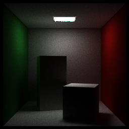

# Astral

ray tracing in one weekend renderer

## Sample Scene

1. cornell box


## Feature List

- Faster Iterating Scene using Bounding Volume Hierarchy
- Constant Density Mediums Volume Rendering

## Build From Source

Clone the project.
`https://github.com/hanyangl5/Astral.git`

Generate project using cmake
`cmake . -B build -DCMAKE_BUILD_TYPE=Release -G <generator>`

Compile and run. 

## Usage

To run the renderer, use the following command:

```
./renderer [options]
```

The available options are:
- `-o, --output`: Specify the output file name. Default is `output.png`.
- `-w, --width`: Specify the width of the output image. Default is `256`.
- `-h, --height`: Specify the height of the output image. Default is `256`.
- `-s, --spp`: Specify the number of samples per pixel. Default is `16`.
- `-t, --thread`: Specify the number of threads to use. Default is the maximum available threads on your system.
- `-i, --sample scene index`: Specify the index of the scene to render. Available options are:
  - `1`: Cornell box
  - `2`: Cornell smoke
  - `3`: Scene1

For example, to render the Cornell box scene with a width of 512, height of 512, and 32 samples per pixel, you can use the following command:

```
./renderer -w 512 -h 512 -spp 256 -s 32 -i 1 -o output.png
```

The rendered image will be saved as `output.png` in the current directory.

## License

This program is licensed under the MIT License. See the [LICENSE](LICENSE) file for more details.
